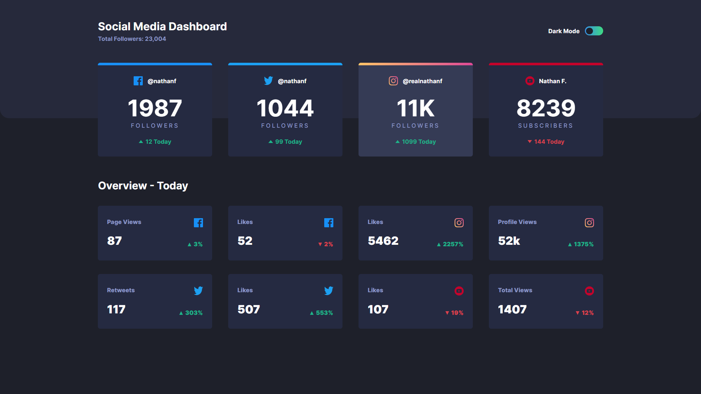

# Frontend Mentor - Social media dashboard with theme switcher solution

This is a solution to the [Social media dashboard with theme switcher challenge on Frontend Mentor](https://www.frontendmentor.io/challenges/social-media-dashboard-with-theme-switcher-6oY8ozp_H). Frontend Mentor challenges help you improve your coding skills by building realistic projects. 

## Table of contents

- [Overview](#overview)
  - [The challenge](#the-challenge)
  - [Screenshot](#screenshot)
  - [Links](#links)
- [My process](#my-process)
  - [Built with](#built-with)
  - [What I learned](#what-i-learned)
  - [Continued development](#continued-development)
  - [Useful resources](#useful-resources)
- [Author](#author)

**Note: Delete this note and update the table of contents based on what sections you keep.**

## Overview

### The challenge

Users should be able to:

- View the optimal layout for the site depending on their device's screen size
- See hover states for all interactive elements on the page
- Toggle color theme to their preference

### Screenshot



### Links

- Live at: [Vercel Deploy](https://social-media-dash-theme-toggle.vercel.app/)

## My process

### Built with

- Semantic HTML5 markup
- Flexbox
- Mobile-first workflow
- [Next.js](https://nextjs.org/) - React framework
- [Next Theme](https://www.npmjs.com/package/next-themes)


### What I learned

To use Next Theme to wrap all the children on the next root layout for the theme management in the pages.
important to know that it already manages also the user preferences, and user choice.

Using the provider file you can set the ThemeProvider from next-Themes:

```tsx 
'use client'
import { ThemeProvider } from 'next-themes'

export default function Providers({ children }: { children: React.ReactNode }) {
    return (
        <ThemeProvider attribute='class' >
            {children}
        </ThemeProvider>
    )
}
```
_Then_

```tsx 
export default function RootLayout({
  children,
}: {
  children: React.ReactNode
}) {
  return (

    <html
      lang="en"
      // Do not use mindlessly
      suppressHydrationWarning 
    >
      <body className={inter.className}>
        <Providers>
          <div className='background_image'>
            {children}
          </div>
        </Providers>
      </body>
    </html>
  )
}
```

So every child will have access to the theme on the provider.

**Caveats:** the hydrantion process can bring a error for the server class on the main tag in one and the client side is other, you can manage it by creating the class manually and it will only be changed or, in some cases using the `suppresHydrationWarning`

### Continued development

Although I could finish it with a certain ease, would like to get it done simpler and faster.

### Useful resources

- [npm | Next-Themes](https://www.npmjs.com/package/next-themes) - Very helpfull for the theme management in the next applications.


## Author

- Frontend Mentor - [Felipe Baldim Guerra](https://www.frontendmentor.io/home)
- LinkedIn - [Felipe Baldim Guerra](https://www.linkedin.com/in/felipe-baldim-guerra-858556127/)


